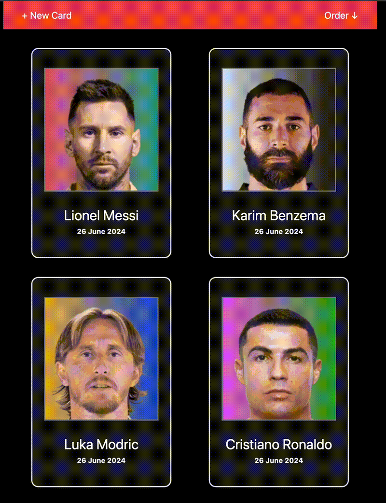

# Unagi Frontend Test

## Steps

### 1. Show a single static card on `/collection` page
- ✅ Basic

Bonus points (can be done in arbitrary order):
- ✅ Add TS types/interfaces where applicable.
- ✅ Convert code to fetch the player image without having the full URL,
  but by generating it with the existing ID.

- ✅ Implement simple lazy loading for the player image, show loading indicator
  while the image is loading.

This one was pretty hard and I was surprised there wasn't an easy lib to handle the behaviour I wanted, since `load="lazy"` wouldn't be enough for the requirements, so here is what I implemented:

Images only start loading when the img element is on the screen, and, while image is not loaded, render a loading skeleton

Check [the source file](./src/pages/LazyImage.tsx)
Or the demo:

  

- ✅ Format player DOB in a human-readable way.

NOTE: there is an obvious way, by just doing `new Date().toLocaleDateString()`, which would give the format '6/26/2024' for 'en-us' and '26/06/2024' to almost everyone else, but I'm interpreting the "human-readable" to be something in the lines of "26 June 2024"/"26 juin 2024" for "en-us"/"fr"

### 2. Fetch collection from a fake REST API
- ✅ Basic

Bonus points (can be done in arbitrary order):

- ✅ Add loading state in the UI.
- ✅ Handle error state, e.g. if the server returns 500.

About these last two points, I would normally use [TanStack Query](https://tanstack.com/query/latest/docs/framework/react/overview) and maybe the `Suspense` API, that automatically handles loading and error state, but I'm assuming this part should be done by hand to show that I know how to do basic data fetching without libs.

- ✅ Implement a reusable card component.

Already implemented on previous step

- ❌ Replace existing plain CSS styles with Styled Components if you see the benefits.

While I do have a ton of experience with styled-components, I haven't used it in a while (in favor of tailwind) and didn't want to waste time setting it up and porting the styles already done

- ✅ Add TS types/interfaces in React components where applicable.
been doing since I started

### 3. Edit the popup on `/create-card` page

- 🤷 Basic

I had too many questions about this one:

**First**, the `/create-card` page is a standalone page and not a 'popup',  I'm guessing it should be a modal to be oppened from the collections page? I'll have to roll with this.

**Second**, to be able to input arbitrary data on this form seems to be in conflict with step 1, which uses a valid fotmob id to fetch the player image. Even if I do some 'validation', fetching the fotmob api would be necessary, to see if that id exists and have an image, and from there, it makes no sense to provide anything else than the id in card creation, since the rest of the data is resolvable from the api.

**Therefore** I decided to let the user *dynamically search for a player name* instead, and then have the option to add to collection.

Bonus points (can be done in arbitrary order):

- ❌ Implement client-side validation.

I tend to use zod for that, but here, since there is no manual form (just an autocomplete suggestion box instead), it didn't make much sense.

- 🤷 Implement REST/REST-like endpoint(s).

Do you mean implement client-side CRUD-requests? The BE is already REST so that is the only thing I could think as an interpretation of this point.
In any case check [the client api](./src/lib/collection.ts), I didn't implement 'update' only because didn't have the time to check how PATCH works on json-server for nested data.

- ✅ Add TS types/interfaces where applicable.

- ✅ Handle server-side errors, e.g. 4xx on submitting.

All of the logic is contained in the [useCollection](./src/lib/useCollection.ts) hook, in redux (strict, elm-like) style.

### 4. Show all the cards as a collection

- ✅ Basic

Bonus points (can be done in arbitrary order):
- ✅ Add loading state in the UI.
- ✅ Add empty state (endpoint returns an empty array).
- ✅ Add simple client-side ordering by any criteria - DOB/Last name/First name etc.
  with a UI control, e.g. Radio button.

### Extra:

There is a lot of things unstyled, but at least the basic cards I could do something about:

- background of player photo generates a gradient background with the player id as seed
- 3d following effect
- card shine reflection effect

Demo:

  

